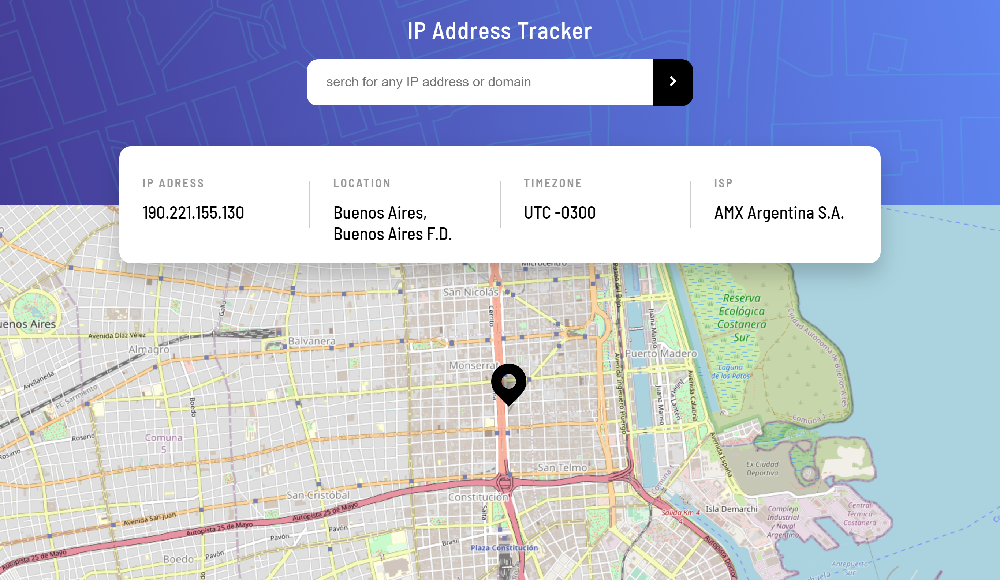
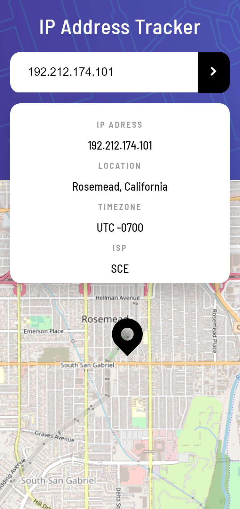

# Frontend Mentor - IP address tracker solution

This is a solution to the [IP address tracker challenge on Frontend Mentor](https://www.frontendmentor.io/challenges/ip-address-tracker-I8-0yYAH0). Frontend Mentor challenges help you improve your coding skills by building realistic projects. 

## Table of contents

- [Overview](#overview)
  - [The challenge](#the-challenge)
  - [Screenshot](#screenshot)
  - [Links](#links)
- [My process](#my-process)
  - [Built with](#built-with)
  - [What I learned](#what-i-learned)
  - [Continued development](#continued-development)
  - [Useful resources](#useful-resources)
- [Author](#author)
- [Acknowledgments](#acknowledgments)


## Overview

### The challenge

Users should be able to:

- View the optimal layout for each page depending on their device's screen size
- See hover states for all interactive elements on the page
- See their own IP address on the map on the initial page load
- Search for any IP addresses or domains and see the key information and location

### Screenshot


Here are my results: 






### Links

- Solution URL: [Github source](https://github.com/LucasNahuel/ip-address-tracker)
- Live Site URL: [ip-address-tracker on vercel](https://ip-address-tracker-xi-bice.vercel.app/)

## My process

### Built with

- HTML5
- CSS custom properties:
  - Flexbox
  - Media Queries
- [React](https://reactjs.org/) - JS library

### What I learned

This is the first time i've needed to reference the inner native html component in a react project. I've resolved this with the usage of the useRef hook.

The actual issue began when i programatically tried to call a event from an input element and realized i had no reference to the element. More specifically, the "setCustomValidity()" and "reportValidity()" methods.
I've resolved this as follow: 
define an input reference with the useRef hook on the component:

```javascript

    const inputRef = useRef(null);

```

and mark with the ref the input:

```jsx

    <input ref={inputRef}/>

```

with that, now i can access all native methods from the element, accessing them from the "current" property of the reference:

```javascript

    inputRef.current.setCustomValidity("not valid ip found");
```


### Continued development

This is a pretty basic project. I think could be improved by adding loading state animations and transitions between state changes.


### Useful resources

- [setCustomValidity](https://developer.mozilla.org/en-US/docs/Web/API/HTMLObjectElement/setCustomValidity) - This helped me to manipulate the default html error notification. First time using it as i´ve always used to implement custom error notification.

- [reportValidity](https://developer.mozilla.org/en-US/docs/Web/API/HTMLFormElement/reportValidity) - This is needed to use along with "setCustomValidty" in order to display the error to the user.

- [useRef hook](https://www.w3schools.com/react/react_useref.asp) - Quick guide to reference html elements for his manipulation, as replacement for the selectors from the javascript DOM api selectors.

## Author

- Website - [Munoz Lucas Portfolio](https://angular-portfolio-lake.vercel.app/)
- Frontend Mentor - [@LucasNahuel](https://www.frontendmentor.io/profile/LucasNahuel)
- LinkedIn - [@Luki](https://www.linkedin.com/in/luki/)


## Acknowledgments

Thanks to the [ipApi](https://ipapi.co/) for the free ip tracking services in replacement of the suggested from the actual frontend mentor suggestion. And better, imo, as this does not require api key and doesn't have number of calls restrictions.

